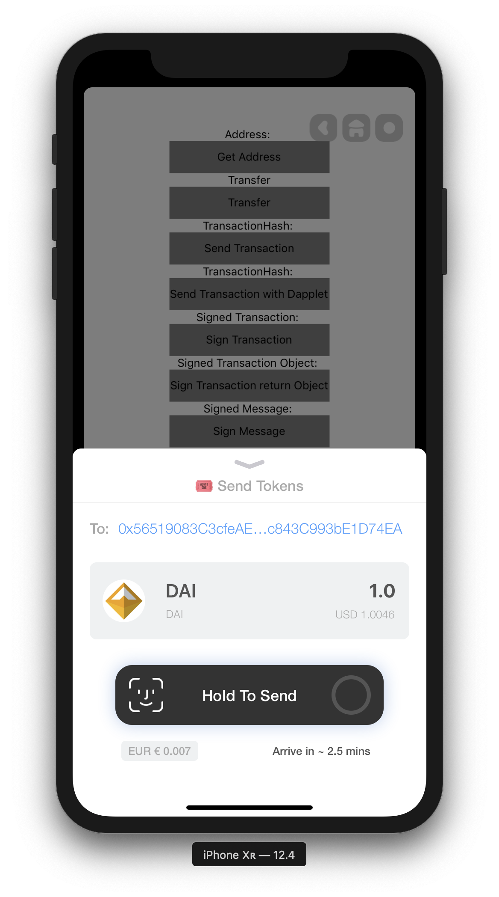
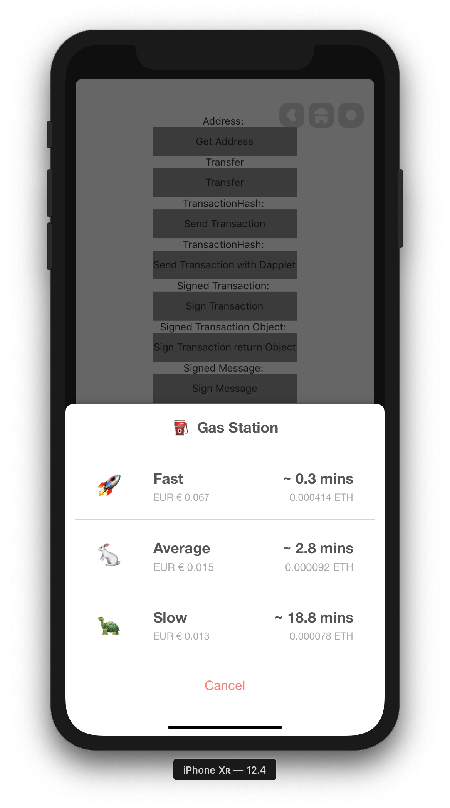
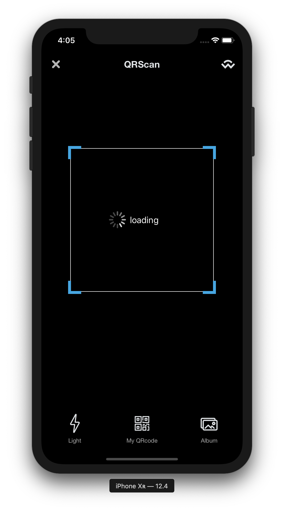

# Alice Android

### Core Features

- **Dapp Browser （浏览器）**

  - 注入 Web3.js，能对接主流 Dapp 网站

  - 支持切换网络

  - 可交互，工具栏 （参考 iOS）

  - 能清Cookie

  - 

Example

    

      
    

    

    

- **React Native Hybrid**

  - 互相通讯

  -  将 RN 嵌入原生模块

  - RN  ->  原生( Support promise )

    - getAddress

      - 获取当前 账号地址

    - getNetwork

      - 获取当前 网络

    - getBalance

      - 获取当前 账号余额

    - sendTransaction

      - 创建并发送 交易

      - 

Example

        

          
        

        

    - signMessage

      - 用私钥对 String 就行加密

      - 

Example

        

          
        

        

    - signTransaction

      - 用私钥对 交易 就行加密 （不发送至区块链）

      - 

Example

        

          
        

        

    - sendToken

      - 发送 ERC20 Token

      - 

Example

        

          
        

        

    - transfer

      - 能向另一个账号，转账 （只支持 eth）

      - 

Example

        

          
        

        

    - write ( Smart Contract )

      - 调用 Smart Contract

      - 

Example

        

          
        

        

    - read ( Smart Contract )

      - 读取 Smart Contract

  - 原生 -> RN

    -  sendWalletChangedEvent

      - 用户更换 账号，通知RN

    - sendNetworkChangedEvent

      - 用户更换 网络，通知RN

    - orientationChange *

      - 用户改变 手机方向，通知RN

    - DeeplinkEvent *

      - 支持外链，传给 RN

      

- **Wallet ( [Web3Java](https://github.com/web3j/web3j) )**

  - 创建钱包

  - 导入钱包

  - 

Example

      

        
      

      

  - 保存用户私钥，在本地，不可被破解
      

Example

      

        
      

      

  - 支持多国货币 （[CoinMarketCap](https://coinmarketcap.com/api/documentation/v1/)）

    

Example

      

        
      

      

  - 能更改 Gas Price （[GasStation](https://docs.ethgasstation.info)）

    - 

Example

      

        
      

      

  - 能监听 pending transaction

  - 能切换网络，支持自定义网络

    - 

Example

      

        
      

      

  - 错误提示与ErrorCode ([Doc](https://github.com/alicedapp/AliceX-iOS/blob/92d3cf747634e42a35f2f52ea8b160a5b7e24802/AliceX/Modules/Wallet/WalletError.swift))

    - 

Example

      

        
      

      

  

  

- **QR Code Scanner**

  - 支持 二维码识别

  - 支持 本地选择图片

  - 

Example

    

      
    

    

- **Wallet Connet ([Doc](https://github.com/WalletConnect/wallet-connect-kotlin))**

  - 通过 Wallet Connect 与网站完成交互

  - 监控本地 socket 通讯

    

- **Notification 通知**

  - 支持 特定跳转 （直接进入小程序）

  

### UI (主页面)

- Mini Program （目前 RN）
  - 小程序入口
- Assets（目前 RN， 将替换成原生）
  - 用户所有资产
- Profile（目前 RN， 将替换成原生）
  - 用户所有交易记录

### Extention Feature

- Multiple Pin （微信，悬浮窗）

  - 支持 小程序

  - 支持 网页

  - 支持 交易（Transaction）

  - 

Example

    

      
      
    

    

### Manual Modules 

---

- **Mapbox**
  - https://github.com/nitaliano/react-native-mapbox-gl/blob/master/android/install.md
- **react-native-camera**
  - https://github.com/react-native-community/react-native-camera/blob/master/docs/installation.md#Android
- **react-native-onesignal**
  - https://documentation.onesignal.com/docs/react-native-sdk-setup
- **RNSVG**
  - https://github.com/react-native-community/react-native-svg#android-pre-rn-060
- **RNReactNativeHapticFeedback**
  - https://github.com/milk-and-cookies-io/react-native-haptic-feedback#Android
- **CodePush**
  - https://github.com/microsoft/react-native-code-push/blob/master/docs/setup-android.md
- **RNGestureHandler**
  - https://kmagiera.github.io/react-native-gesture-handler/docs/getting-started.html#android

### Extension Documents 

- https://facebook.github.io/react-native/docs/integration-with-existing-apps
- https://reactnative.cn/docs/integration-with-existing-apps/
